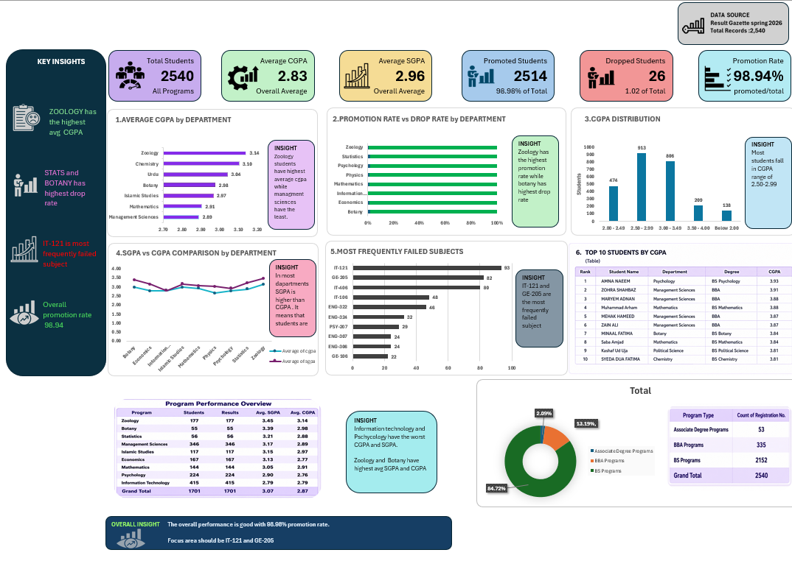
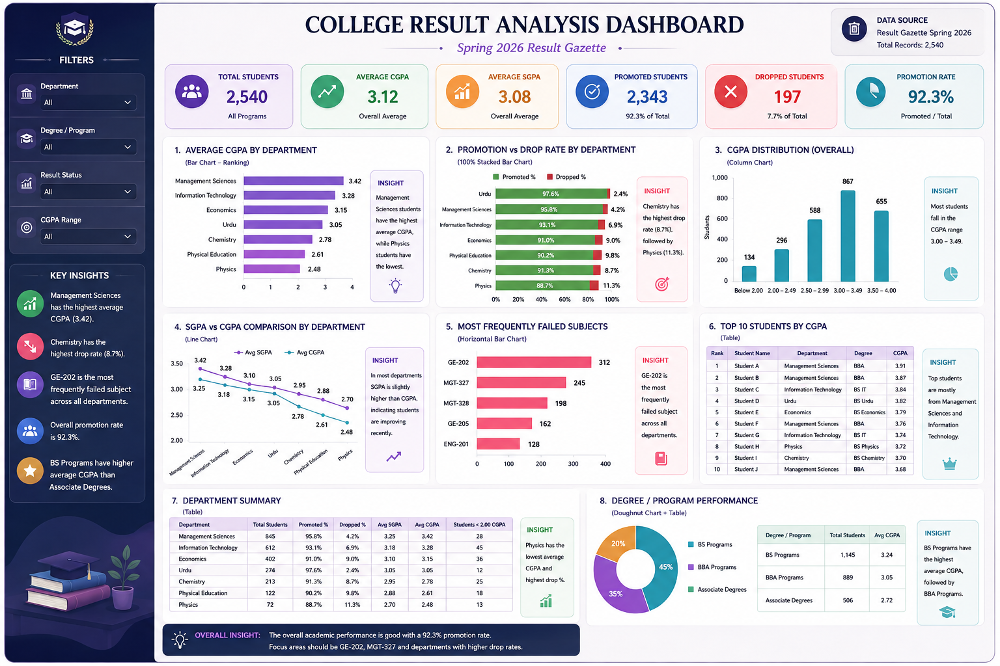

# 🎓 College Result Analysis Dashboard

An end-to-end **Data Analytics project** built to analyze the Spring 2026 academic results of Government Murray College, Sialkot.

The project transforms a multi-page result gazette into a structured dataset, loads it into **PostgreSQL**, performs analytical queries, and presents the findings through an interactive **Microsoft Excel dashboard**.

---

## 🖼️ Dashboard Preview

<!-- Add your main dashboard screenshot here -->



<br>


## 📌 Project Overview

The source data contains student-level academic results including:

- Department
- Degree / Program
- Result Status
- SGPA
- CGPA
- Failing Subjects

The main objective of the project is to identify patterns in academic performance across departments and degree programs, understand promotion/drop outcomes, and highlight frequently failed subjects.

---

## 🎯 Business Questions

This project focuses on questions such as:

- Which departments have the highest average CGPA?
- How does promotion/drop rate vary across departments?
- How are students distributed across different CGPA ranges?
- How does average SGPA compare with average CGPA by department?
- Which subjects have the highest number of recorded failures?
- How does academic performance differ across degree/program types?
- Who are the top-performing students based on CGPA?

---

## 🛠️ Tools & Technologies

| Tool | Purpose |
|---|---|
| **PostgreSQL** | Data storage and SQL analysis |
| **SQL** | Aggregation, filtering, ranking, KPI calculations and analysis |
| **Microsoft Excel** | Dashboard creation and visualization |
| **Power Query** | PostgreSQL connection, data transformation and preparation |
| **PivotTables** | Interactive analysis and summarized views |
| **PivotCharts** | Dashboard visualizations |
| **Excel Slicers** | Interactive filtering |
| **VS Code** | SQL/project development |
| **Git & GitHub** | Version control and project presentation |

---

## 🔄 Project Workflow

```text
Result Gazette PDF
        ↓
Data Extraction & Cleaning
        ↓
Clean CSV Dataset
        ↓
PostgreSQL Database
        ↓
SQL Analysis
        ↓
Power Query
        ↓
Excel Tables / PivotTables
        ↓
Charts + Slicers
        ↓
Interactive Dashboard
```

---

## 🗃️ Dataset

**Source:** University of Gujrat – Result Gazette Spring 2026  
**Campus/Institute:** Government Murray College, Sialkot

The original PDF contains student results across multiple departments and degree/programs.

For the public GitHub version, personally identifying student information should be **anonymized or excluded** before publishing the dataset.

> **Privacy Note:** Academic records can contain personal information. The public version of this project uses an anonymized dataset and should not expose student names, registration numbers, or roll numbers.

---

## 🧹 Data Preparation

The original PDF was converted into a structured CSV and prepared for analysis.

Main preparation steps included:

- Extracting student-level records from the PDF
- Structuring columns consistently
- Standardizing department and degree information
- Handling missing SGPA/CGPA values
- Preserving failing-subject information
- Creating derived fields such as **CGPA Band**
- Creating program-level categories for dashboard analysis
- Checking duplicate and inconsistent records

---

## 🗄️ PostgreSQL Database

The cleaned dataset was loaded into PostgreSQL using a table similar to:

```sql
CREATE TABLE college_results (
    pdf_page INTEGER,
    department TEXT,
    degree TEXT,
    sr_no INTEGER,
    roll_no TEXT,
    registration_no TEXT,
    name TEXT,
    result_status TEXT,
    sgpa NUMERIC(3,2),
    cgpa NUMERIC(3,2),
    failing_subjects TEXT
);
```

PostgreSQL was then used as the main analysis layer.

---

## 📊 SQL Analysis

Examples of SQL analysis performed in the project include:

### Department Performance

```sql
SELECT
    department,
    COUNT(*) AS total_students,
    ROUND(AVG(sgpa), 2) AS avg_sgpa,
    ROUND(AVG(cgpa), 2) AS avg_cgpa
FROM college_results
WHERE cgpa IS NOT NULL
GROUP BY department
ORDER BY avg_cgpa DESC;
```

### Promotion Rate

```sql
SELECT
    department,
    ROUND(
        100.0 *
        COUNT(*) FILTER (WHERE result_status = 'Promoted')
        / COUNT(*),
        2
    ) AS promotion_rate
FROM college_results
GROUP BY department;
```

### Top Students

```sql
SELECT
    name,
    department,
    degree,
    sgpa,
    cgpa
FROM college_results
WHERE cgpa IS NOT NULL
ORDER BY cgpa DESC
LIMIT 10;
```

The complete SQL scripts are included in the project repository.

---

# 📈 Excel Dashboard

The final dashboard was developed in Microsoft Excel using **Power Query, PivotTables, PivotCharts and Slicers**.

### Dashboard Features

- KPI cards
- Average CGPA by Department
- Promotion vs Drop Rate by Department
- CGPA Distribution
- SGPA vs CGPA comparison
- Most Frequently Failed Subjects
- Top 10 Students by CGPA
- Department Summary
- Degree / Program Performance
- Interactive slicers for filtering

---


---

## 🖼️ CHAT GPT Generated image

### As a sample for design and color combination



### Excel Dashboard Detail


### Power Query / Data Preparation


---


---

## 🔍 Key Analytical Areas

The dashboard is designed around four main analytical perspectives:

### 1. Academic Performance
Average SGPA, average CGPA and CGPA distribution.

### 2. Department Comparison
Department-level performance and promotion/drop outcomes.

### 3. Program Analysis
Comparison of different degree/program categories.

### 4. Academic Risk Indicators
Recorded failing subjects, low-CGPA groups and drop outcomes.

---

## 🔄 Excel–PostgreSQL Integration

Excel was connected directly to PostgreSQL using **Power Query**.

This allows the dashboard data to be refreshed from the database rather than manually exporting separate CSV files for every analysis.

```text
PostgreSQL
     ↓
Power Query
     ↓
Excel Tables / PivotTables
     ↓
Charts
     ↓
Dashboard
```

---

## 💡 What I Learned

Through this project I practiced:

- Working with semi-structured PDF data
- Data cleaning and transformation
- Relational database concepts
- PostgreSQL and SQL querying
- Aggregations with `GROUP BY`
- Conditional calculations
- Ranking and analytical queries
- Excel Power Query
- PivotTables and PivotCharts
- Interactive slicers
- Dashboard layout and data storytelling
- Connecting SQL analysis with business-oriented visualization

---

## 🚀 Future Improvements

Possible extensions for the project include:

- Automating the PDF-to-database pipeline
- Adding multiple semesters for historical trend analysis
- Creating subject-level performance analysis where subject marks are available
- Adding statistical analysis of score distribution
- Building the same dashboard in Power BI
- Automating dashboard refresh and reporting

---

## 👤 Project

**College Result Analysis Dashboard**  
Built as a portfolio project to demonstrate practical skills in:

**SQL + PostgreSQL + Excel + Power Query + Data Visualization**
